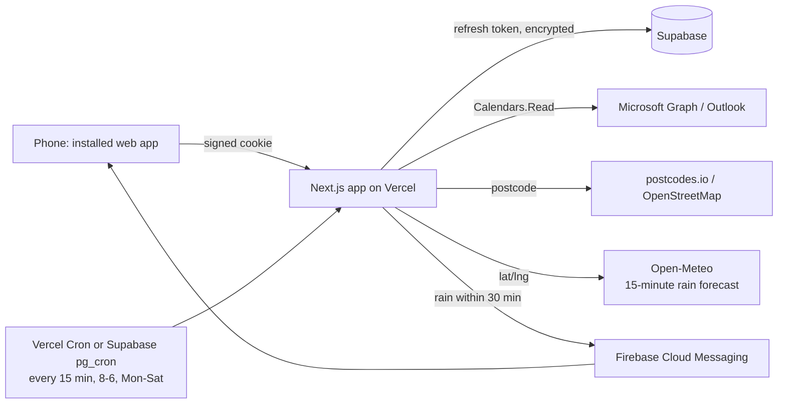

# How it works (plain English)

## The shape of it



## The lock

Every page and API call goes through one gate (`src/proxy.ts`). No valid, signed session cookie means
you are sent to the sign-in page. The cookie is only issued after Microsoft confirms who you are
**and** the app checks that it is the one allowed account. The Entra ID registration is single-tenant
on top of that, so accounts outside the business cannot even start the sign-in.

## Why the background job can read the calendar

When you sign in, Microsoft gives the app two things: a short-lived access token (an hour) and a
long-lived refresh token (about 90 days, renewed every time it is used). The refresh token is
encrypted with the app's secret and stored in Supabase. The 15-minute rain check uses it to fetch a
fresh access token without you doing anything. If Microsoft ever refuses the refresh (password
change, long inactivity), the app marks it, shows a "sign in again" banner on the Today screen and
sends one push to say alerts are paused.

## Where the rain check looks

1. A job that is happening right now -> that job's address.
2. Otherwise the next job today, if it starts within the next hour -> that address.
3. Otherwise home base (Wolverhampton WV3).

Addresses become coordinates through the UK postcode (postcodes.io, free and exact), with
OpenStreetMap as a fallback for odd addresses. Results are cached so each address is looked up once.
No GPS is used, so the Play Store review does not see a background-location permission.

Then Open-Meteo gives rain in 15-minute steps for the next three hours. If any of the next two steps
(30 minutes) shows rain (0.1 mm or more, the smallest amount it reports), a push goes out - once per
place per 90 minutes, so a showery day does not buzz every quarter of an hour. All three numbers live
in the `app_settings` table.

The weather code is behind a small interface (`src/lib/weather/types.ts`). Swapping in AccuWeather
MinuteCast later means one new file and one environment variable; screens and the cron do not change.

## Offline

A service worker (`public/sw.js`) keeps the last copy of the schedule, weather, prices and gallery
listing, plus the app shell. The Today screen also keeps its last schedule in the phone's local storage
and shows it instantly with a "last copy from HH:MM" note when there is no signal. Push notifications
arrive through the same service worker.

## Prices

`config/pricing.json` is the seed and the safety net. Once the Supabase migration has run, the
`pricing_items` table is the live source, so prices can be changed in the Supabase table editor
without touching code. The same rows are meant to feed a future "pick a service -> price auto-fills"
step in the booking flow.

## Quotes

The Quote screen builds a multi-item quote (vehicle size, packages, coatings, add-ons, plans) and can
send it three ways: by email from your own Microsoft 365 mailbox (Graph `sendMail`, needs the
`Mail.Send` permission, copy lands in Sent Items), by WhatsApp (opens the app with the text ready),
or as shared/copied text. Every quote is stored in the `quotes` table with the customer details and
totals, so a "past quotes" screen is a small addition later. The server recalculates the totals from
the live price list before sending, so the phone can never send a stale or edited price.

## The door left open for phase 2 (quick-add booking)

- `src/lib/calendar/graph.ts` is a general Graph client (`graphFetch`) - adding a `POST /me/events`
  call is a few lines in the same file.
- Scopes live in one list (`GRAPH_SCOPES` in `src/lib/auth/oauth.ts`). Add `Calendars.ReadWrite`,
  grant consent in Entra ID once, sign in again. Same client ID, same tokens, same storage.
- The pricing data already has stable ids per service/tier for a booking form to reference.

## Folder map

```
src/app/                 screens (Today, Prices, Gallery, Settings, Login, Offline) and API routes
src/components/          UI pieces
src/lib/auth/            Microsoft sign-in, session cookie, encrypted token store
src/lib/calendar/        Graph client, Wix-booking event parser, schedule builder, sample data
src/lib/weather/         provider interface + Open-Meteo
src/lib/geo/             address -> coordinates
src/lib/rain/            "where to look" + the 15-minute check itself
src/lib/push/            FCM sender (server) and token registration (browser)
config/pricing.json      price list seed
supabase/migrations/     database schema + seed
public/sw.js             offline cache + push handling
android/                 Bubblewrap / Play Store wrapper config
docs/                    this folder
```
