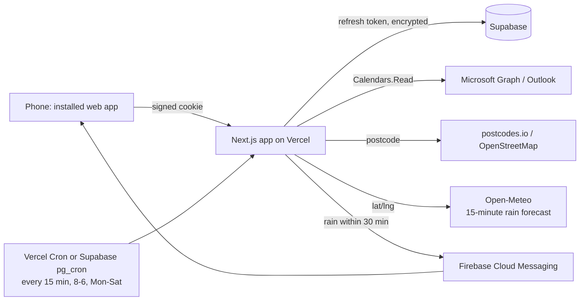

# How it works (plain English)

## The shape of it



## The lock

Every page and API call goes through one gate (`src/proxy.ts`). No valid, signed session cookie means
you are sent to the sign-in page. The cookie is only issued after Microsoft confirms who you are
**and** the app checks that it is the one allowed account. The Entra ID registration is single-tenant
on top of that, so accounts outside the business cannot even start the sign-in.

## Why the background job can read the calendar

When you sign in, Microsoft gives the app two things: a short-lived access token (an hour) and a
long-lived refresh token (about 90 days, renewed every time it is used). The refresh token is
encrypted with the app's secret and stored in Supabase. The 15-minute rain check uses it to fetch a
fresh access token without you doing anything. If Microsoft ever refuses the refresh (password
change, long inactivity), the app marks it, shows a "sign in again" banner on the Today screen and
sends one push to say alerts are paused.

## Where the rain check looks

1. A job that is happening right now -> that job's address.
2. Otherwise the next job today, if it starts within the next hour -> that address.
3. Otherwise home base (Wolverhampton WV3).

Addresses become coordinates through the UK postcode (postcodes.io, free and exact), with
OpenStreetMap as a fallback for odd addresses. Results are cached so each address is looked up once.
No GPS is used, so the Play Store review does not see a background-location permission.

Then Open-Meteo gives rain in 15-minute steps for the next three hours. If any of the next two steps
(30 minutes) shows rain (0.1 mm or more, the smallest amount it reports), a push goes out - once per
place per 90 minutes, so a showery day does not buzz every quarter of an hour. All three numbers live
in the `app_settings` table.

The weather code is behind a small interface (`src/lib/weather/types.ts`). Swapping in AccuWeather
MinuteCast later means one new file and one environment variable; screens and the cron do not change.

## Offline

A service worker (`public/sw.js`) keeps the last copy of the schedule, weather, prices and month
calendar, plus the app shell. The Today screen also keeps its last schedule in the phone's local storage
and shows it instantly with a "last copy from HH:MM" note when there is no signal. Push notifications
arrive through the same service worker.

## Calendar (the whole month)

The Calendar screen asks `/api/calendar?month=YYYY-MM` for one month at a time. That route runs the
same Graph `calendarView` call the Today screen uses, just over a wider date range, and parses the
events with the same Wix-booking parser. Every fetched month is written to the `calendar_cache` table
under the id `month-YYYY-MM` and to the phone's local storage, so a month you have already opened
still shows with no signal (with a "last copy from ..." note).

The grid is Monday-first UK time, one gold dot per job (a number once there are more than three),
a gold outline on today and a filled gold square on the day you tap. Tapping a day lists that day's
jobs with call, email, directions and "open in Outlook"; "Whole month" instead lists every booked day
in order. The month heading counts the jobs, the booked days and the booked hours. Swiping left and
right moves between months, as do the arrows.

## Prices

`config/pricing.json` is the seed and the safety net. Once the Supabase migration has run, the
`pricing_items` table is the live source, so prices can be changed in the Supabase table editor
without touching code. The same rows are meant to feed a future "pick a service -> price auto-fills"
step in the booking flow.

## Quotes

The Quote screen builds a multi-item quote (vehicle size, packages, coatings, add-ons, plans) and can
send it three ways: by email from your own Microsoft 365 mailbox (Graph `sendMail`, needs the
`Mail.Send` permission, copy lands in Sent Items), by WhatsApp (opens the app with the text ready),
or as shared/copied text. Every quote is stored in the `quotes` table with the customer details and
totals, so a "past quotes" screen is a small addition later. The server recalculates the totals from
the live price list before sending, so the phone can never send a stale or edited price.

## Stock (chemicals)

Each chemical is tracked as a percentage of the current bottle (`stock_items`). Every job type
(Full Valet, Deep Clean, ceramic job and so on) has a list of "this job uses X% of that bottle"
(`stock_usage`), edited on the Stock screen under Per job. The same 15-minute scheduled check that
does the rain watch also looks back 36 hours for calendar jobs that have finished, matches the job
title to a job type using the word rules under Stock > Rules, takes the percentages off, and logs
each deduction (`stock_events`). Jobs that match nothing are listed on the Stock screen so you can
pick a type once; the choice is remembered as a new rule. When anything drops to its minimum
(10% by default) one push goes out listing the low items, then not again for 7 days unless the
bottle is restocked. Levels can be corrected by hand at any time (slider, plus and minus buttons,
or "New bottle").

## Maintenance plans

Everyone on a plan is a row in `plans`: which tier, how often, what it costs and when it started.
Visits are not ticked off by hand - the same 15-minute check looks back over recent bookings, matches
them to a plan customer by name (plus any extra words set against that customer) and records the
visit in `plan_visits`, keyed on the calendar event id so the same booking is never counted twice.
The next visit is due one cadence after the last one, and each plan is coloured by how close that is:
late, due today, due soon, or fine. One push a day goes out for anything due or overdue, and a tile
appears on the Today screen. Visits can still be added or the plan paused by hand.

## Job photos

Photos taken when arriving at a car - dated evidence of its condition before any work started. They
go in a **private** Supabase bucket (`job-photos`): never publicly readable, always served through
one-hour signed links, because they show customers' cars at their homes. The phone shrinks each one
to 1600px JPEG (about 300 KB) before uploading and applies the EXIF rotation, so portrait shots are
the right way up and the free 1 GB of storage holds roughly 3,000 photos. Each row records the
booking, the date, the customer and whether it is a before, after or damage shot.

## Product spend

The Spend screen totals what has been spent on chemicals, read from the supplier order emails already
sitting in Outlook. It searches the mailbox (Graph `Mail.Read`) **only** for the suppliers listed in
the `purchases` setting, then pulls an order reference and a total out of each email. A total it can
read confidently is counted; one it cannot is listed under "needs a figure" rather than guessed at,
and anything that is not really an order can be dismissed. Purchases can also be typed in by hand.
The scan runs at most twice a day inside the scheduled check, or on demand from the screen.

## The door left open for phase 2 (quick-add booking)

- `src/lib/calendar/graph.ts` is a general Graph client (`graphFetch`) - adding a `POST /me/events`
  call is a few lines in the same file.
- Scopes live in one list (`GRAPH_SCOPES` in `src/lib/auth/oauth.ts`). Add `Calendars.ReadWrite`,
  grant consent in Entra ID once, sign in again. Same client ID, same tokens, same storage.
- The pricing data already has stable ids per service/tier for a booking form to reference.

## Folder map

```
src/app/                 screens (Today, Calendar, Plans, Prices, Stock, Spend, Settings, Login, Offline) and API routes
src/components/          UI pieces
src/lib/auth/            Microsoft sign-in, session cookie, encrypted token store
src/lib/calendar/        Graph client, Wix-booking event parser, schedule builder, sample data
src/lib/plans/           maintenance plans: due dates, calendar matching, reminders
src/lib/photos/          job photos: private bucket, signed links, on-phone shrinking
src/lib/spend/           product spend: supplier email search and order parsing
src/lib/weather/         provider interface + Open-Meteo
src/lib/geo/             address -> coordinates
src/lib/rain/            "where to look" + the 15-minute check itself
src/lib/push/            FCM sender (server) and token registration (browser)
config/pricing.json      price list seed
supabase/migrations/     database schema + seed
public/sw.js             offline cache + push handling
android/                 Bubblewrap / Play Store wrapper config
docs/                    this folder
```
